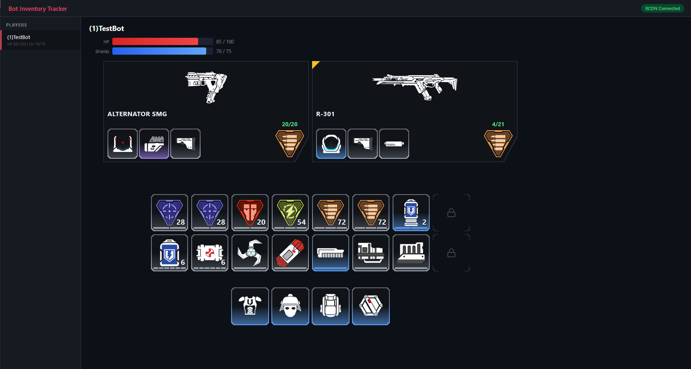

# Bot Inventory tracker

## Preview (latest)


## Preview (older version)



## Setup

in game console after loading map:

```
sv_rcon_password "botaidebug"; rcon_encryptframes 0; sv_rcon_sendlogs 1; rcon_maxframesize 4096
```

run tracker:

```sh
npm i
npm start
```

load tracker in browser via http://localhost:3000/
